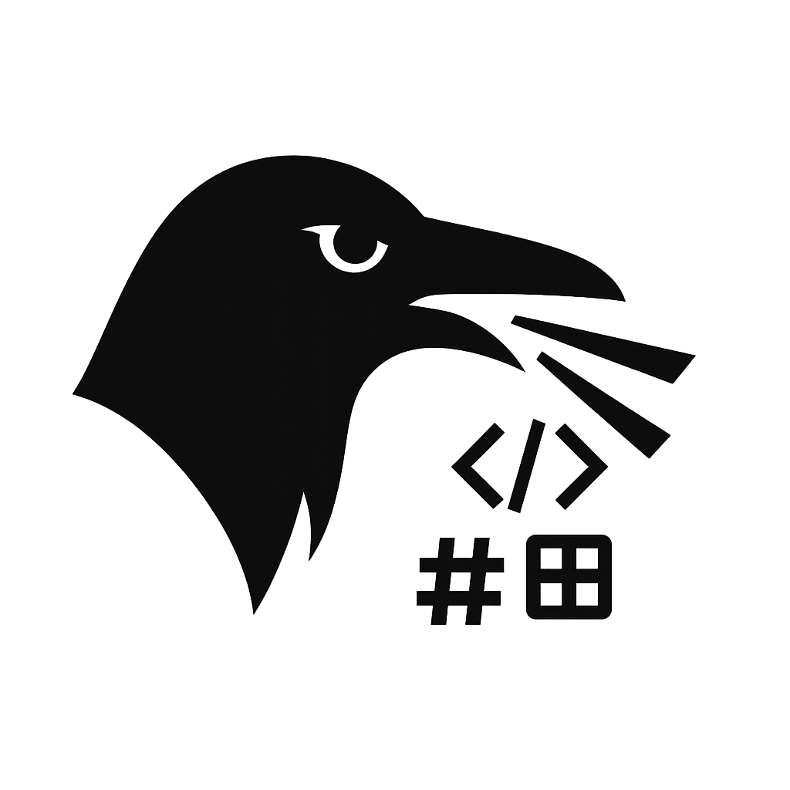
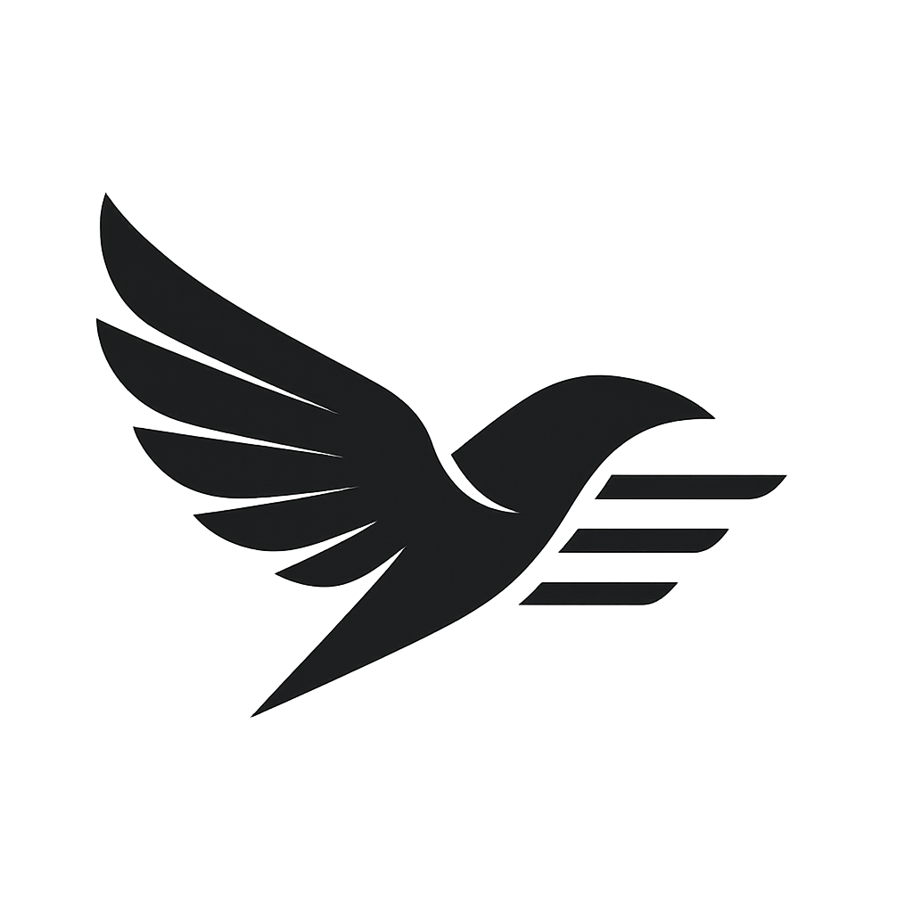
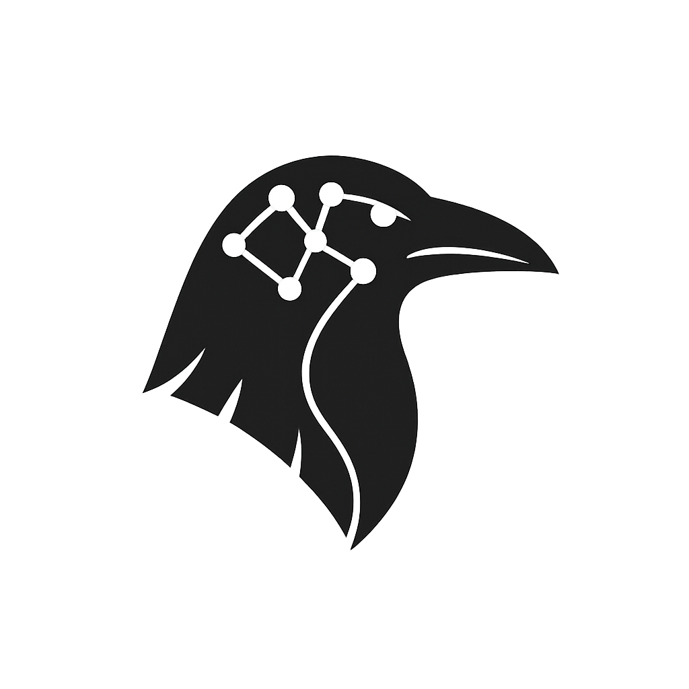
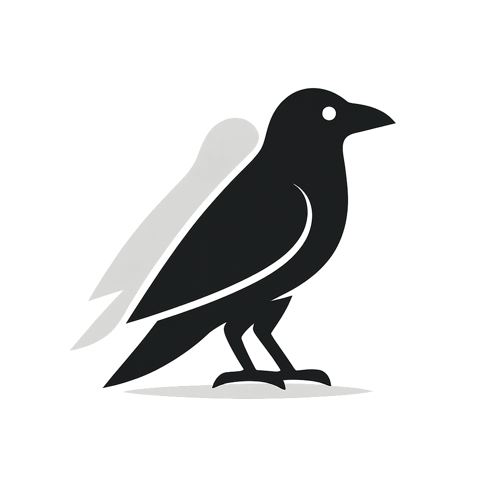
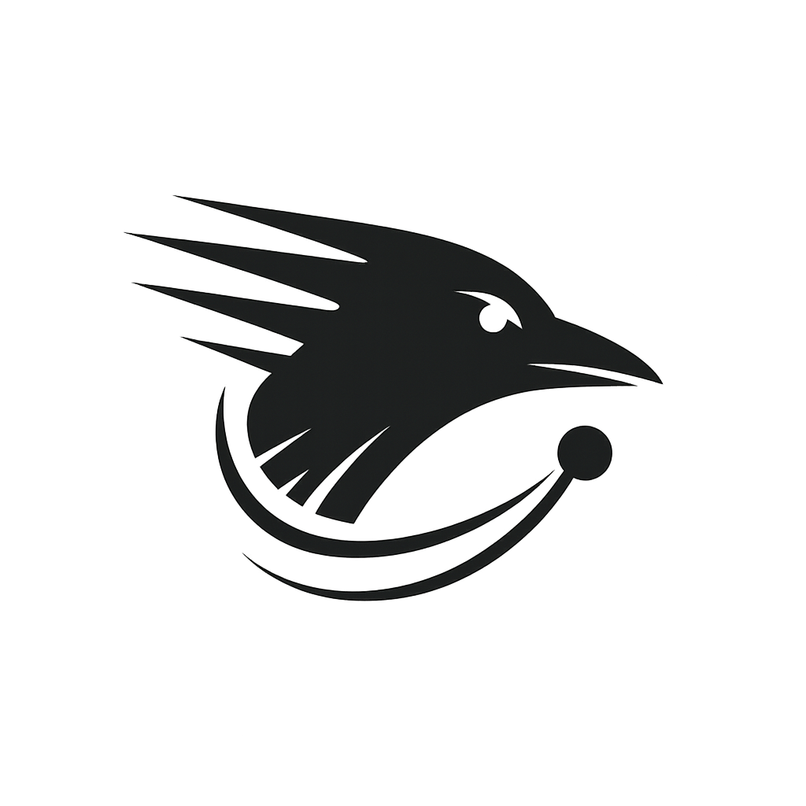
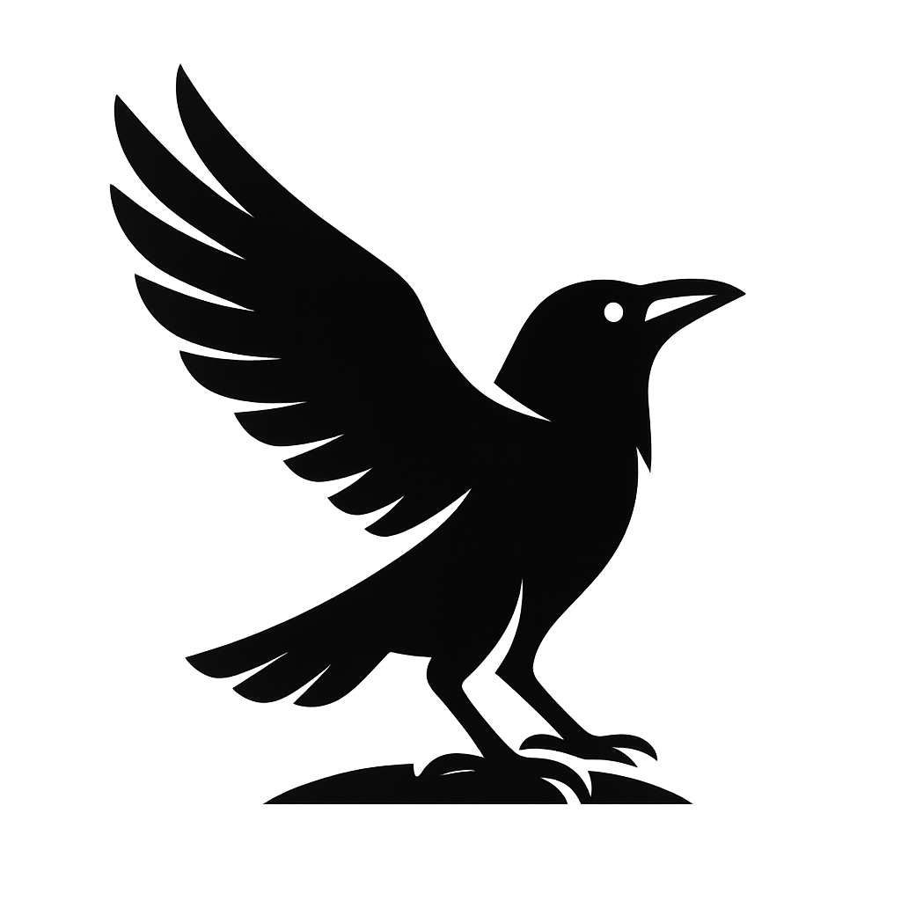
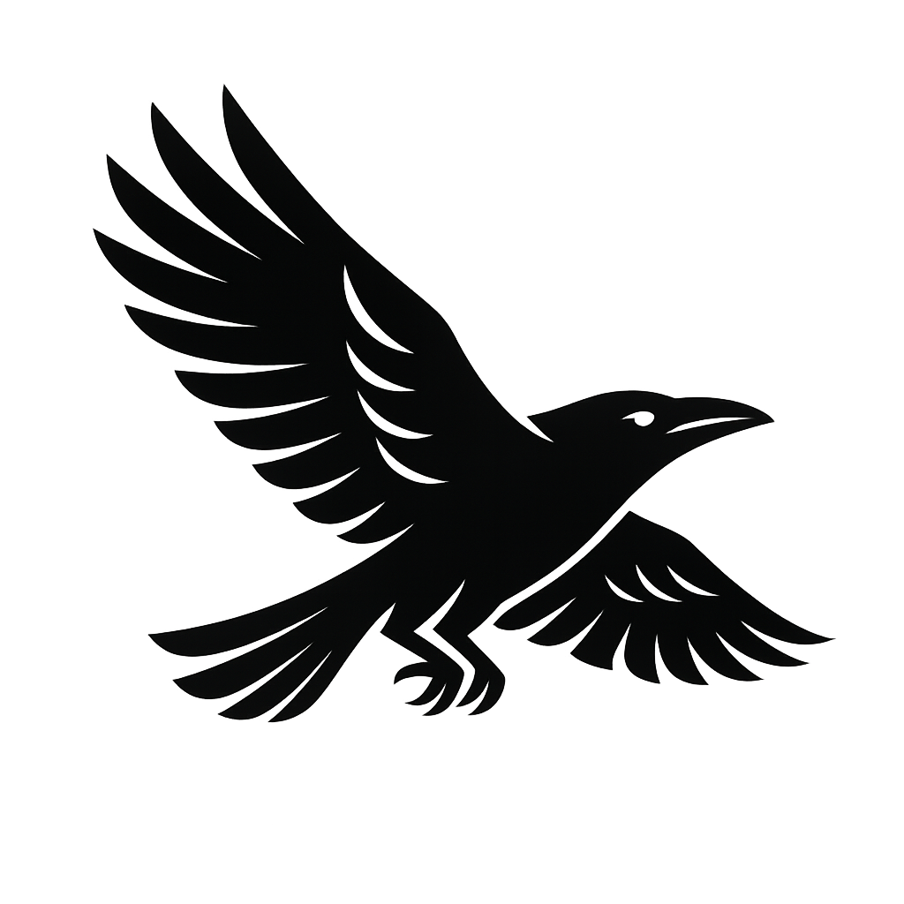
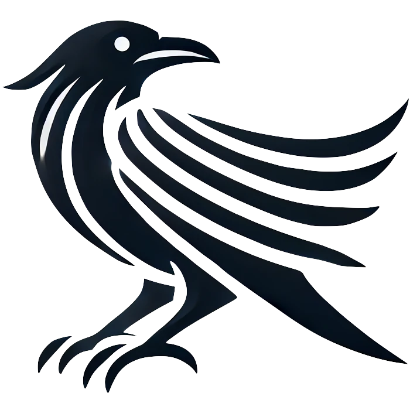
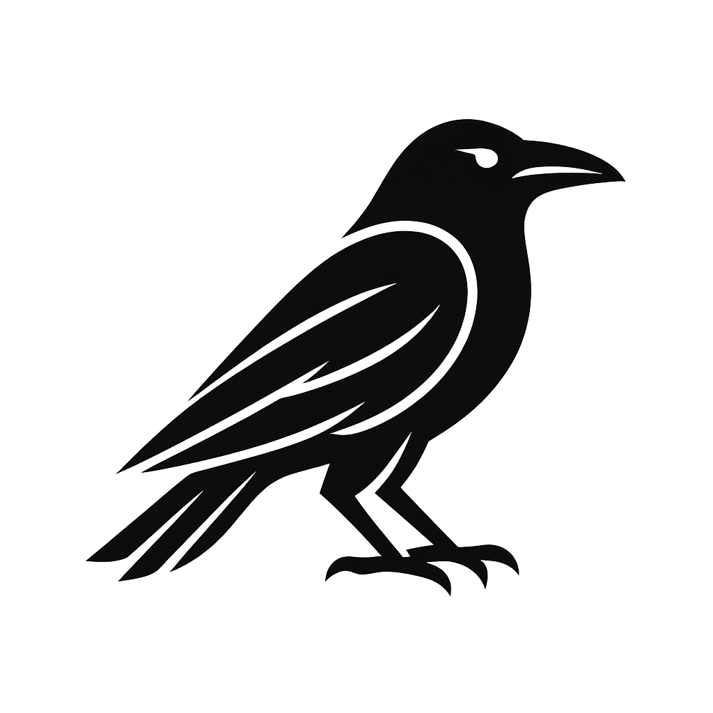

# 🦅 The RavenJS Flock

## Why This Flock Is Organized the Way It Is

RavenJS is not another "all-or-nothing" framework.
It's a **toolkit of sharp, standalone parts** (libraries) and **focused movements** (tools) you can drop into _any_ modern JavaScript project — plus a full framework (`@raven-js/raven`) that stitches them together when you want the whole bird.

- **Libraries** — runtime dependencies you import into your codebase. Standalone, zero bloat, tree-shakable.
- **Tools** — CLI executables you run on your apps/packages — building, bundling, shipping.
- **Platform** — the framework foundation and ecosystem glue that makes everything feel seamless.

> Everything here is designed so you can pick only what you need, without carrying dead weight.
> Every package (except the full `raven` framework and workspace tools) is valuable on its own.

---

## 📦 Libraries — Runtime Dependencies (Standalone)

**Libraries** are drop-in functionalities you `npm install` and use directly in your application code. These are dependency-free standalone utilities that become part of your application's runtime. Each one provides a specific function you can import and use immediately. They're designed to be lightweight, focused, and tree-shakable, so you only bundle what you actually use.

### 🦜 Beak — _Templating_

  

JSX-like templates without the weight. 4.2KB minified+gzipped vs 201KB (Pug). Zero build dependency, complete JavaScript runtime access, platform-native performance.

**Status:** ✅ **Complete** - Production ready with 48x smaller bundles than alternatives

**Features:**

- [x] HTML templating with XSS protection and automatic escaping
- [x] CSS-in-JS with object→kebab-case conversion and minification
- [x] SQL query building with injection prevention
- [x] GitHub Flavored Markdown parsing in 4KB
- [x] JavaScript code generation and component architecture
- [x] SEO meta generators (OpenGraph, Twitter, robots)
- [x] VS Code & Cursor extension with full syntax highlighting
- [x] Performance benchmarks: 0.68ms rendering, 2.83ms cold starts

---

### 🦅 Wings — _Routing_

  

Zero-dependency isomorphic routing that actually works. Same routes everywhere - server, CLI, wherever. DevServer with WebSocket reload, ClusteredServer for production scaling, built-in HTTPS support.

**Status:** ✅ **Complete** - Production ready with multi-environment support

**Features:**

- [x] Isomorphic routing (Server HTTP + CLI commands)
- [x] DevServer with WebSocket-based live reload and HTTPS
- [x] ClusteredServer with automatic worker restart and CPU scaling
- [x] Built-in HTTPS support with certificate generation
- [x] CLI command routing via Terminal module
- [x] Interactive CLI utilities (ask, confirm, table, colored output)
- [x] Logger middleware with performance indicators
- [x] Combined runtimes (single app handles web + CLI operations)

---

### 👁️ Eye — _Logging & Tracing_

  

Sharp vision: structured logs and lightweight tracing spans.

**Status:** 📋 **Planned**

**Features:**

- [ ] Structured logging with levels
- [ ] Lightweight tracing spans
- [ ] Performance monitoring
- [ ] Error tracking and reporting
- [ ] Log formatting and output
- [ ] Integration with external monitoring

---

### 🧠 Cortex — _Data Generation & Handling_

  

The raven's brain: submodules for **AI** (structured LLM output), **SQLite** (native Node 22.5+ helpers), and **Data** (format utilities, transforms). Zero deps, TS-ready.

**Status:** 📋 **Planned**

**Features:**

- [ ] AI submodule (structured LLM output)
- [ ] SQLite helpers for Node 22.5+
- [ ] Data format utilities and transforms
- [ ] Schema validation and processing
- [ ] Type-safe data handling
- [ ] Integration with external AI services

---

### 🕶️ Shades — _Testing Utilities_

  

See into the dark: mocks, doubles, spies, fake timers, and request stubs.

**Status:** 📋 **Planned**

**Features:**

- [ ] Mock objects and doubles
- [ ] Spy functions and call tracking
- [ ] Fake timers and date manipulation
- [ ] Request stubs and HTTP mocking
- [ ] Test data generators
- [ ] Assertion utilities
- [ ] Integration with testing frameworks

---

### ⚡ Reflex — _SPA Reactivity & DOM_

  

Universal reactive signals with automatic SSR, seamless hydration, and zero-dependency DOM updates. Works everywhere - browser, Node.js, Deno, Bun. Perfect integration with Wings routing and Beak templating.

**Status:** ✅ **Complete** - Production ready with universal reactivity

**Features:**

- [x] Universal signals (signal, computed, effect) that work everywhere
- [x] Automatic SSR with embedded state and fetch caching
- [x] Perfect hydration with no flicker or duplicate requests
- [x] DOM mounting and patching utilities for browser environments
- [x] Automatic resource cleanup (timers, event listeners)
- [x] SSR timeout protection with graceful degradation
- [x] Browser API shims prevent SSR crashes
- [x] Seamless Wings integration for fullstack reactivity

---

## 🛠 Tools — CLI Executables (Standalone)

**Tools** are CLI packages you use in your Node.js/npm project to operate on your whole application. They might have a few handpicked dependencies but won't interfere with your app code itself. These can be used directly with runners like `npx` without needing local installation. They help you build, bundle, deploy, and manage your projects from the outside, not as part of your application's runtime.

### 🔍 Glean — _Documentation_

  

Glean documentation gold from your codebase. JSDoc parsing, validation, and beautiful doc generation with surgical precision.

**Status:** 🚧 **In Development** - Core architecture complete, features in progress

**Features:**

- [x] JSDoc parsing and extraction from JavaScript files
- [x] Documentation validation and completeness checking
- [x] Fast in-memory class tree analysis
- [x] Zero dependencies with pure Node.js implementation
- [ ] Beautiful documentation site generation
- [ ] Advanced validation rules and reporting
- [ ] Integration with build pipelines

---

### 🐣 Fledge — _Build & Bundle_

  

From nestling to flight-ready. Modes: **standalone binary**, **script blob**, **static folder** (SSG).

**Status:** 📋 **Planned**

**Features:**

- [ ] Standalone binary generation
- [ ] Script blob bundling
- [ ] Static site generation (SSG)
- [ ] Asset optimization and compression
- [ ] Development server with hot reload
- [ ] Production build optimization
- [ ] Multiple output formats

---

### 🦅 Soar — _Deploy_

  

Take to the sky: clean submodule exports for **cloudflare**, **aws-lambda**, **do-droplet**, and more.

**Status:** 📋 **Planned**

**Features:**

- [ ] Cloudflare Workers deployment
- [ ] AWS Lambda packaging
- [ ] DigitalOcean Droplet deployment
- [ ] Vercel and Netlify integration
- [ ] Docker containerization
- [ ] Environment-specific builds
- [ ] Deployment automation

---

## 🏠 Platform — Framework Foundation (Ecosystem Glue)

### 🦅 Raven — _Application Framework_

  

The full bird: bootable/extendable framework that composes all capabilities into a seamless developer experience.

**Status:** 📋 **Planned**

**Features:**

- [ ] Framework bootstrapping
- [ ] Capability composition
- [ ] Developer experience tooling
- [ ] Configuration management
- [ ] Plugin system
- [ ] Application lifecycle management
- [ ] Integration with all RavenJS packages

---

### 🪺 Nest — _Monorepo Automation_

  

The janitor and automation tool for the RavenJS monorepo itself. Handles package validation, testing, documentation generation, version management, and release workflows. This is private internal tooling that keeps the RavenJS ecosystem clean and organized.

**Status:** ✅ **Complete** - Private package for internal monorepo management

**Features:**

- [x] Package validation and testing across the monorepo
- [x] Documentation generation and management
- [x] Version management and semver bumping
- [x] Task runner for monorepo operations
- [x] Workspace package discovery and management
- [ ] Release workflows and automation
- [ ] Repository maintenance and cleanup
- [ ] Monorepo health monitoring and reporting

---

### 🎯 CLI — _Command-Line Interface_

  

The standard companion tool for framework usage: create new app skeletons, scaffold components, and bootstrap RavenJS projects. Installed globally as `raven`, it provides the familiar developer experience you expect from modern frameworks.

**Status:** 📋 **Planned**

**Features:**

- [ ] Create new RavenJS applications (`raven create my-app`)
- [ ] Generate components, pages, and utilities (`raven generate component Button`)
- [ ] Scaffold project structure and configurations
- [ ] Interactive project setup with guided prompts
- [ ] Template generation for common patterns
- [ ] Integration with Nest, Fledge, and Soar workflows
- [ ] Project migration and upgrade assistance

---

## Legend

- ✅ **Complete** - Ready for production use
- 🚧 **In Development** - Actively being built
- 📋 **Planned** - On the roadmap, not yet started

---

## 🦅 Support RavenJS Development

If you find RavenJS helpful, consider supporting its development:

Your sponsorship helps keep RavenJS **zero-dependency**, **modern**, and **developer-friendly**.

---

**Built with ❤️ by [Anonyfox](https://anonyfox.com)**

