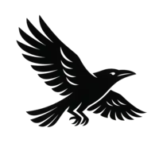

# @raven-js/soar 🦅

[](https://ravenjs.dev)
[](https://www.npmjs.com/package/@raven-js/soar)
[](https://nodejs.org/)

<div align="center">
  
</div>

> **Raven's deployment strike** - Zero-dependency deployment tool for modern JavaScript

Soar provides surgical precision for deployment operations - VPS, serverless, and static hosting. Built with zero dependencies and modern JavaScript, it offers the sharp tools needed to deploy any artifact to any target with the intelligence and efficiency ravens are known for.

## Installation

```bash
npm install -D @raven-js/soar
```

## Usage

```javascript
import { deploy, plan } from "@raven-js/soar";

// Plan deployment (dry-run)
const deploymentPlan = await plan(config);
console.log(deploymentPlan);

// Execute deployment
const result = await deploy(config);
console.log(result);
```

## Philosophy

Soar embodies the Raven philosophy of surgical precision in deployment:

- **Zero dependencies** - No supply chain vulnerabilities
- **Modern JavaScript** - ESNext features, no transpilation
- **Platform-native** - Built on Node.js built-ins and native APIs
- **Universal compatibility** - Deploy any artifact to any target

---

<div align="center">

## 🦅 Support RavenJS Development

If you find RavenJS helpful, consider supporting its development:

[](https://github.com/sponsors/Anonyfox)

Your sponsorship helps keep RavenJS **zero-dependency**, **modern**, and **developer-friendly**.

---

**Built with ❤️ by [Anonyfox](https://anonyfox.com)**

</div>
