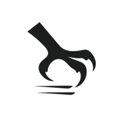

# @raven-js/talons 🦅

[](https://ravenjs.dev)
[](https://www.npmjs.com/package/@raven-js/talons)
[](https://nodejs.org/)

<div align="center">
  
</div>

> **Raven's grip on data** - Zero-dependency data interaction library for modern JavaScript

Talons provides surgical precision for data interaction patterns - databases, APIs, and data sources. Built with zero dependencies and modern JavaScript, it offers the sharp tools needed to handle data with the intelligence and efficiency ravens are known for.

## Installation

```bash
npm install @raven-js/talons
```

## Usage

```javascript
import { hello } from "@raven-js/talons";

console.log(hello()); // "Hello, world!"
```

## Philosophy

Talons embodies the Raven philosophy of surgical precision in data interaction:

- **Zero dependencies** - No supply chain vulnerabilities
- **Modern JavaScript** - ESNext features, no transpilation
- **Platform-native** - Built on Node.js and browser APIs
- **Surgical focus** - Each function does one thing exceptionally well

---

<div align="center">

## 🦅 Support RavenJS Development

If you find RavenJS helpful, consider supporting its development:

[](https://github.com/sponsors/Anonyfox)

Your sponsorship helps keep RavenJS **zero-dependency**, **modern**, and **developer-friendly**.

---

**Built with ❤️ by [Anonyfox](https://anonyfox.com)**

</div>
